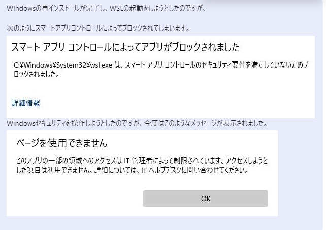
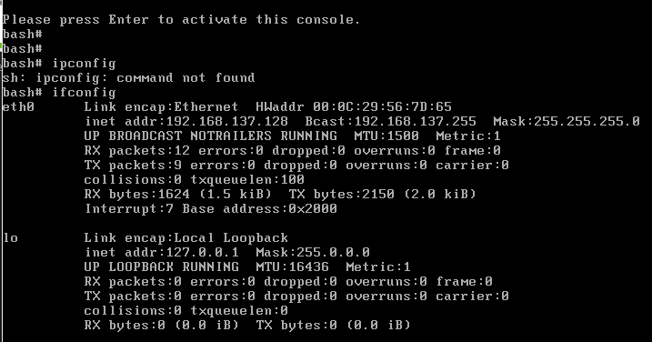
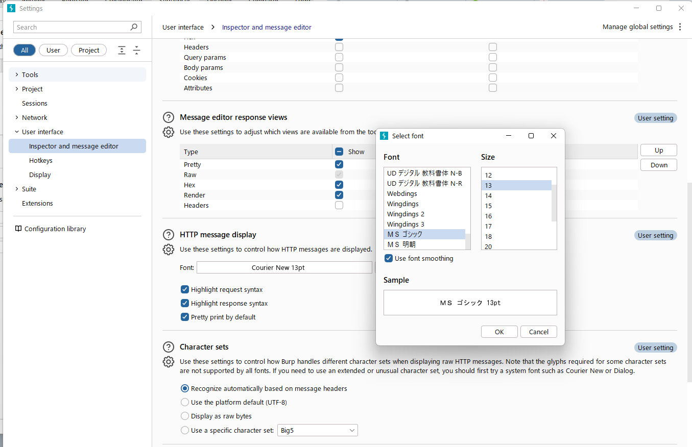
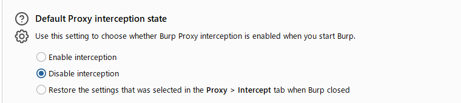
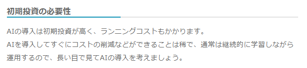
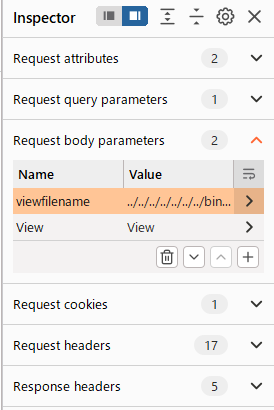
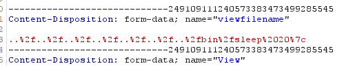

## 4月(4/19~)
- [4月(4/19~)](#4月419)
  - [4/19](#419)
  - [4/20](#420)
  - [4/21](#421)
  - [4/22](#422)
  - [4/23](#423)
  - [4/24](#424)
  - [4/25](#425)

### 4/19

utコマンドの修正。2つの配列token_list, typeをmain内に入れてほかの関数に引数で渡すようにしたら -c 1-3のようなハイフンの入った入力に対してうまく実行されなかった(ファイルの内容をそのまま出力していた) 

オプションの引数をパースして受け取る配列token_listは引数の数が事前にわかっているので、静的配列でいいのではないかと思ったけど、2や-3, 1-3のような様々な形の引数を受け取
必要があるので動的配列にする必要がある

配列をmain関数内で宣言してから、ほかの関数に先頭のポインタを渡して、関数内でmallocでメモリを割り与えるという処理に変更したら、segment errorが出てしまった。

検索してたら、これが原因ぽい

https://oswald.hatenablog.com/entry/20081210/1228920110

実行例

```
  1 #include<stdio.h>
  2 #include<stdlib.h>
  3
  4 void hairetu_change(int *hairetu) {
  5   hairetu = malloc(sizeof(int)*5);
  6   for(int i = 0; i < 5; i++) {
  7     hairetu[i] = 100*i;
  8   }
  9 }
 10
 11 int main() {
 12   int *hairetu;
 13   hairetu_change(hairetu);
 14   for(int i = 0; i < 5; i++) {
 15     printf("%d\n", hairetu[i]);
 16   }
 17 }
```

実行結果

```
-98693133
-1991643855
-1991745839
-461158174
1163153648
```

```
#include<stdio.h>
#include<stdlib.h>

int* hairetu_change(int *hairetu) {
  hairetu = malloc(sizeof(int)*5);
  for(int i = 0; i < 5; i++) {
    hairetu[i] = 100*i;
  }
  return hairetu;
}

int main() {
  int *hairetu;
  int *new_hairetu = hairetu_change(hairetu);
  for(int i = 0; i < 5; i++) {
    printf("%d\n", new_hairetu[i]);
  }
}
```

```
0
100
200
300
400
```

実行例
```
#include<stdio.h>
#include<stdlib.h>

void hairetu_change(int **hairetu) {
  *hairetu = malloc(sizeof(int)*5);
  for(int i = 0; i < 5; i++) {
    (*hairetu)[i] = 100*i;
  }
}

int main() {
  int *hairetu = NULL;
  hairetu_change(&hairetu);
  for(int i = 0; i < 5; i++) {
    printf("%d\n", hairetu[i]);
  }
}
```

実行結果
```
0
100
200
300
400
```


### 4/20
土曜日。Terraformの講座を進めたのと、オプションの価格付けへの遺伝的アルゴリズムの応用の論文を探していた。


### 4/21
ネットワークスペシャリストの試験日。
午後2はSPF, DKIMといったよく知られているプロトコルから出題されたが、結構曖昧なところがあり、あまり自信がない。

過去問を何回かやりこむのと、Youtubeの動画などを参考にして、各プロトコルの仕組みを説明できるまで理解する必要があると感じた。


### 4/22
ブログ記事でのオプション価格へのGAの応用部分を書いていた。


### 4/23
昨日の実装の修正や実装の書いた後に、数式部分を画像化した。


「脆弱性診断スタートガイド」をはじめた。
この記事、割と最近で参考になりそう
https://sqripts.com/2023/07/21/60002/

BadStoreのダウンロードページ
https://archives.tricorder.jp/webpen/

### 4/24
hostsファイルにBadStoreの設定を追加しようとしたら、なぜか管理者ユーザーでもhostsファイルにアクセスできなくなってしまった。
そのため、OSを前日に復元したが、今度はWSLが使えなくなってしまった...。(コマンドプロンプト上でwslと入力しても「ファイルにアクセスできません。)
結局、OSの再インストールをした。

OSの再インストールした後にWSL使おうとしたら次のような状態になった


[こちらの記事](https://windows-waza.com/win11-windows-security-is-blank-restricted-by-it-administrator/)の情報で解決した


その後も Linux カーネル更新プログラム パッケージをダウンロードし忘れて、
Error: 0x800701bc が出るなどした


脆弱性の本に戻って、まずはBadStoreの設定をした(順番が逆だけど)
今度はhostsファイルの設定もすんなりできた


OWASP ZAPを使うにはJAVAの実行環境を準備する必要がある
OWASP ZAPのダウンロードサイト
https://www.zaproxy.org/download/

JAVAの実行環境をダウンロードしたのに、エラーが出た
-> [こちらの記事](https://note.com/guppi_vrchat/n/n8b3fd1c5b8fd)を見て解決した。

本のp.140にあるようにOWASP ZAPとBurp Suite Community Editionは同一のポート
を使用しているため、片方のポートを変更する必要がある。

OWASP ZAPのポート番号を8080から8081に変更した。

OWASAZAPで証明書を発行する方法は、本で説明しているのはUIが古くて、
[さっきの記事](https://sqripts.com/2023/07/21/60002/)を参考にした。

OWASA ZAPで発行した証明書は"C:\Users\フォームズ櫛田勇介\Documents\owasa_zap_certification\zap_root_ca.cer"
に置いた

BurpSuiteで発行した証明書は
"C:\Users\フォームズ櫛田勇介\Documents\burpsuite_certification\BurpSuiteCA.der"

- BadStoreのURL
http://www.badstore.net/
当然だけど、VMWareでイメージを起動してないと表示されないので注意

プロキシ OWASAZAP(ポート8081)用も作る

### 4/25
この図のようにHTTP通信を行う際に(一般的には)
クライアントはプロキシサーバのポート8080番に対して通信を送る


今回はBurpSuiteには8080番宛て, OWASA ZAPには8081番宛てに通信を送る予定

なぜか、昨日インストールしたアドオンと、それぞれのプロキシのCAが消えていたので再び入れなおした。

BurpSuite, OWASA ZAPのIPアドレスを同じ127.0.0.1にしてる

OWASAZAPのネットワーク設定　本とだいぶUIが違う
ツールタブ-> オプション -> Network　で開くことができる

Cookieによるログイン認証　https://zenn.dev/masahiro_toba/books/3daf7dc0d5dfd7/viewer/e1322e
PHPでのCookieを付与するプログラムの実装も

OWAZAZAPのセッションプロパティについて、
対象のURLを右クリックorファイル->セッションのプロパティ　から開ける
ユーザー、パスワードは本とは違って、セッションプロパティの認証欄では、email, password等のどのパターンを使用するかだけ決めておいて、具体的なユーザーは、攻撃等の実行時にユーザー欄に事前に登録しておいたユーザーから使用するユーザーを決定するみたい

OWASA ZAPで攻撃をした際にnortonでブロックされたので、
詳細表示から15分間セキュリティをオフにした


OWASA ZAPの動的スキャン、静的スキャンの診断結果は診断対象のURLを右クリック->アラートで確認できる

Nortonでセキュリティをオフにしても、許可するリストにbadstoreのURLを入れてもブロックが継続したので、いったんnortonをアンインストールした

6-3の診断対象の記録、セッションを保存しないで終了すると、再開したときにもう一度やり直さないといけないみたい

診断結果のレポートはdocument内owasa_reportに保存

セッションはdocument内owasa_sessionに保存


7章 burpsuite 

ログの保存は
proxy -> Proxy settings -> project ->Logging(注:普通に右上のsettingからproject->Loggingとえらんていける)

日本語の表示


Proxy Interceptは現在ではデフォルトでオフ


Target->SitemapとProxy->HTTP history
前者
ProxyとSpiderの履歴のみ
特定のURLについて調べる場合便利

後者
Proxyのみ
時系列にソート、より詳細に

Parameterタブが見つからないと思ったけど、[こちらの記事](https://forum.portswigger.net/thread/raw-params-headers-not-appear-f1e8e0b1)によると、Inspectorタブを見る必要があるみたい。パラメーターに関しては、p.221で指定されているURL, Body, Cookie, Set-Cookie, Redirectのうち,Inspectorで見つかったものをかいていけばいいか

自分が書いた記事の投稿をするためにwordpressを操作した。
h4タグで装飾がうまく反映されていない
こういう見出しになってほしい


脆弱性とその対策法についてIPAの資料がよく纏まっている
https://www.ipa.go.jp/security/vuln/websecurity/about.html


badstoreでログアウトする場合はcookieを削除する必要がある

p.258のOSコマンドインジェクションで、
本の通りにやったらリクエストは
　


とエンコードされていた

出力結果

```
-----------------------------249109111240573383473499285545
Content-Disposition: form-data; name="viewfilename"

..%2f..%2f..%2f..%2f..%2f..%2f..%2fbin%2fsleep%2020%7c
```
とエスケープされていた
