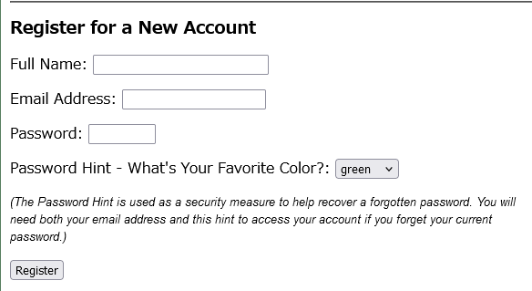

# 脆弱性診断


### 診断対象URL一覧

- トップページ　http://www.badstore.net/
- 

## SQLインジェクション(CWE-89: SQL Injection)
1.リスク評価　高
2.発見箇所
http://www.badstore.net/cgi-bin/badstore.cgi


3.脆弱性詳細

クエリに「searchquery=1000'」と入力した結果、DB関係のSQL Syntax errorが表示されたため、SQLインジェクションがあると判断


### HTTPリクエストメッセージ


### HTTPレスポンスメッセージ


- 表示されるエラーメッセージ


4.脆弱性概要


5.対策


##　クロスサイト・スクリプティング
1.リスク評価 中
2.発見箇所
https://www.badstore.net/cgi-bin/badstore.cgi


### 脆弱性詳細

パラメータ「search_query」に```1000<script>alert(1)</script>```と入力した際にエスケープされずに入力したスクリプトが作動した。

### HTTPリスエストメッセージ


### HTTPレスポンスメッセージ(一部)


## コマンドインジェクション

1.リスク評価 高

2.発見箇所
https://www.badstore.net/cgi-bin/badstore.cgi?action=supplierportal


3.脆弱性詳細

パラメーター「viewfilename」に```../../../../../../../bin/sleep 20|```と入力して「Go」ボタンで実行した際にレスポンスが20秒遅れる。

### HTTPリクエストメッセージ


2.発見箇所
https://www.badstore.net/cgi-bin/badstore.cgi?action=loginregister



+++


　　　　　　　　　　　　　　　　　　　　　　　　　　　　　　　　　　　　　　　　　　　　　　　　　　　　　　　　　　　　　　　　　　　　　　　　　　　　　　　　　　　　　　　　　　　　　　　　　　　　　　　　　　　　　　　　　　　　　　　　　　　　　　　　　　　　　　　　　　　　　　　　　　　　　　　　　　　　　　　　　　　　　　　　　　　　　　　　　　　　　　　　　　　　　　　　　　　　　　　　　　　　　　　　　　　　　　　　　　　　　　　　　　　　　　　　　　　　　　　　　　　