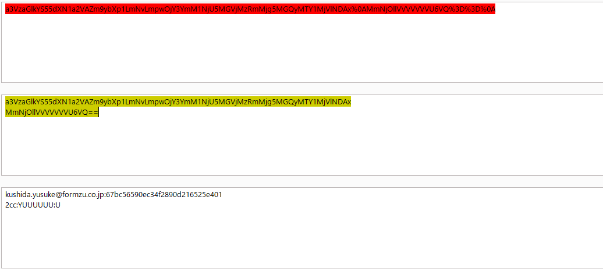
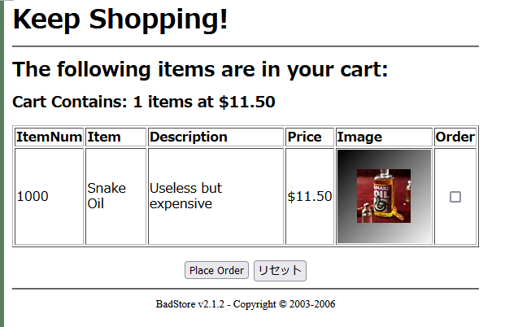
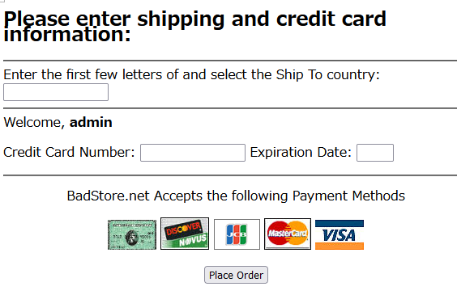
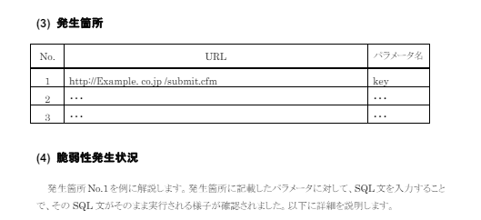

# 脆弱性診断
- [脆弱性診断](#脆弱性診断)
    - [診断対象URL一覧](#診断対象url一覧)
  - [SQLインジェクション(CWE-89: SQL Injection)](#sqlインジェクションcwe-89-sql-injection)
    - [脆弱性発生状況](#脆弱性発生状況)
    - [HTTPリスエストメッセージ](#httpリスエストメッセージ)
    - [HTTPレスポンスメッセージ(一部)](#httpレスポンスメッセージ一部)
  - [コマンドインジェクション(CWE-78: OS command injection)](#コマンドインジェクションcwe-78-os-command-injection)
  - [クリックジャッキング](#クリックジャッキング)
  - [ログアウト機能の不備や未実装](#ログアウト機能の不備や未実装)
  - [過度な認証試行に対する対策不備や未実装](#過度な認証試行に対する対策不備や未実装)
    - [脆弱なパスワードポリシー](#脆弱なパスワードポリシー)
  - [パスワードリセットの不備](#パスワードリセットの不備)
  - [認可制御の不備(CWE-264)](#認可制御の不備cwe-264)
  - [](#)
  - [クロスサイトリクエストフォージェリ](#クロスサイトリクエストフォージェリ)
  - [パストラバーサル](#パストラバーサル)
  - [セッション管理の不備](#セッション管理の不備)
    - [CookieのHttpOnly属性未設定](#cookieのhttponly属性未設定)
    - [推測可能なセッションID](#推測可能なセッションid)
  - [公開不要な機能、ディレクトリの存在](#公開不要な機能ディレクトリの存在)
    - [情報漏洩](#情報漏洩)
    - [画面表示上のマスク不備](#画面表示上のマスク不備)
    - [パスワードフィールドのマスク不備](#パスワードフィールドのマスク不備)
    - [HTTPS利用時のCookieのSecure属性未設定](#https利用時のcookieのsecure属性未設定)
    - [メモ](#メモ)

### 診断対象URL一覧

- トップページ　http://www.badstore.net/
- 

## SQLインジェクション(CWE-89: SQL Injection)
1.リスク評価　高
2.発見箇所
| No. | URL | パラメータ名 |
| ---- | ---- | ---- |
| 1 | http://www.badstore.net/cgi-bin/badstore.cgi | searchquery |
| 2 | https://www.badstore.net/cgi-bin/badstore.cgi?action=loginregister | email


3.脆弱性発生状況

クエリに「searchquery=1000'」と入力した結果、DB関係のSQL Syntax errorが表示されたため、SQLインジェクションがあると判断しました。


- HTTPリクエストメッセージ


- HTTPレスポンスメッセージ


- 表示されるエラーメッセージ


4.想定される脅威
データベースに保存されている情報の漏洩、改ざん、消去や認証回避による不正ログインの恐れがあります。

5.対応策
SQLの組み立てにプレースホルダーを用いて、バインド処理により値を割り当てる処理を推奨します。


##　クロスサイト・スクリプティング
1.リスク評価 中
2.発見箇所
https://www.badstore.net/cgi-bin/badstore.cgi


https://www.badstore.net/cgi-bin/badstore.cgi?action=guestbook

https://www.badstore.net/cgi-bin/badstore.cgi?action=myaccount


https://www.badstore.net/cgi-bin/badstore.cgi?action=loginregister
### 脆弱性発生状況

パラメータ「search_query」に```1000<script>alert(1)</script>```と入力した際にエスケープされずに入力したスクリプトが作動した。

### HTTPリスエストメッセージ


### HTTPレスポンスメッセージ(一部)


4.想定される脅威
本サイト上に偽のページが表示される、ブラウザが保存しているCookieを取得される等の可能性があります。

5.対応策
ウェブページに出力するするすべての要素に対して、エスケープ処理を施す。
URLを出力する際にはhttp, httpsで始まるURLのみを許可する、```<script>...</script>```要素の内容を動的に生成しない等の対策をとる必要があります。


参考情報:
- エスケープ処理の実装例
```
<?php
// エスケープ処理関数
function escape_html($input) {
    return htmlspecialchars($input, ENT_QUOTES, 'UTF-8');
}

// エスケープ処理を施した文字列
$unsafe_html = "<script>alert('Hello, world!');</script>";
$safe_html = escape_html($unsafe_html);

// 安全に表示される
echo "<div>" . $safe_html . "</div>";
?>
```

- スクリプトを動的に生成する実装の例
```
<!-- スクリプトを動的に生成するための要素 -->
<div id="scriptContainer"></div>

<script>
// JavaScriptで動的にスクリプト要素を生成し、内容を設定する
var scriptElement = document.createElement("script");
scriptElement.textContent = scriptContent;

// 生成したスクリプト要素をHTMLに追加する
document.getElementById("scriptContainer").appendChild(scriptElement);
</script>
```


## コマンドインジェクション(CWE-78: OS command injection)

1.リスク評価 高

2.発見箇所
https://www.badstore.net/cgi-bin/badstore.cgi?action=supplierportal


3.脆弱性発生状況

パラメーター「viewfilename」に```../../../../../../../bin/sleep 20|```と入力して「Go」ボタンで実行した際にレスポンスが20秒遅れる。


4.想定される脅威
サーバ内ファイルの閲覧、改ざん、削除や不正なシステム操作をされる恐れがあります。


5.対応策
設計段階でOSコマンド呼び出しを使わない実装方法を選択する、シェル呼び出し機能のある関数の利用を避けるといった対策があります。シェルを起動できる言語機能を利用する場合には、保険的な対策として、引数を構成する全ての変数に対してチェックを行い、あらかじめ許可した処理のみを実行するようにしてください。


2.発見箇所
https://www.badstore.net/cgi-bin/badstore.cgi?action=loginregister


## クリックジャッキング

2.発見箇所　http://www.badstore.net/cgi-bin/badstore.cgi?action=submitpayment


3.脆弱性発生状況
決済の確定処理の直前画面において、レスポンスヘッダにX-Frame-Optionsヘッダフィールドが存在しません。
X-Frame-Optionsヘッダフィールドとは、コンテンツがiframeタグなどで他のサイトに埋め込まれないことを保証しており、
クリックジャッキング攻撃を防いでいます。

(参考:https://developer.mozilla.org/ja/docs/Web/HTTP/Headers/X-Frame-Options)
## ログアウト機能の不備や未実装

参考:https://blog.tokumaru.org/2013/02/purpose-and-implementation-of-the-logout-function.html
1.リスク評価

2.発見箇所
すべてのページ

3.脆弱性発生状況
ログアウト機能が存在せず、セッションIDを消去するためには

4.想定される脅威
共有PCを使っている場合や離席中のパソコンを勝手に使用される場合に、ログインしたままのアプリケーションがあれば、勝手に使われてなりすましをされてしまう恐れがある。

5.対応策
セッションタイムアウト時間を短くする。ログアウト機能の実装をする。

## 過度な認証試行に対する対策不備や未実装
1.リスク評価

2.発見箇所
https://www.badstore.net/cgi-bin/badstore.cgi?action=loginregister


3.脆弱性発生状況
同じユーザー名でパスワードを連続で10回間違った場合でも、アカウントがロックされない。

(4, 5 徳丸本参考)
4.想定される脅威
ブルートフォース攻撃や辞書攻撃によって、繰り返し試行を行うことで不正なログインが行われてしまう。

5.対応策
10回を目安に、パスワードを連続して間違えた場合にはアカウントをロックする。
その後は次のようなルールでアカウントの再有効化を行う
- 30分が経過した際に、自動的に最有効化する
- 何らかの方法で本人確認が行われた後に最有効化する

### 脆弱なパスワードポリシー

1.リスク評価

2.発生個所
https://www.badstore.net/cgi-bin/badstore.cgi?action=loginregister
アカウントの登録画面

3.脆弱性発生状況
パスワードを登録する際に数字のみ(例:0000)のような脆弱なパスワードが登録できてしまう。

4．想定される脅威
パスワードが推測しやすいために、不正にログインされてしまう恐れがある。

5.対応策
パスワードを設定する際に、8桁以上で数値と英小大文字を含むといった、パスワードポリシーを定める。

## パスワードリセットの不備
1.リスク評価

2.発生個所　atode
アカウントの再設定画面
https://www.badstore.net/cgi-bin/badstore.cgi?action=myaccount

3.脆弱性発生状況

## 認可制御の不備(CWE-264)

1.リスク評価　高
2.発見箇所
https://www.badstore.net/cgi-bin/badstore.cgi?action=loginregister

https://www.badstore.net/cgi-bin/badstore.cgi?action=supplierportal

- アカウントの登録画面(No.1)


- Supplier, Admin権限が必要な画面(No.2)

3.脆弱性発生状況
- NO.1
新しいユーザーを作成する際に、権限を示すパラメーター「role」をUからA, Sに書き換えることで、一般ユーザーに対して、サプライヤー権限や管理者権限を付与することができる。その結果、一般ユーザーではアクセスすることのできない情報や機能が閲覧、操作できてしまう。

roleをUからAに書き換え


- No.2
  サプライヤー権限,admin権限が必要なページに対して、そのページのURLを指定することで、認証していない状態でアクセスできてしまう

4.想定される脅威
一般ユーザーが本来閲覧することのできないページを閲覧、編集することで、重要なデータの漏洩、改ざんの恐れがある。

5.対応策
権限の情報をセッション変数に保持することで書き換えを防ぐとともに、処理や表示の直前に権限の確認をするようにしてください。

## 
## クロスサイトリクエストフォージェリ

1.リスク評価　中
2.発見箇所
https://www.badstore.net/cgi-bin/badstore.cgi?action=myaccount

3.脆弱性発生状況
一般ユーザーでログインしていて、アカウント情報を更新する際にRefererヘッダを変更しても更新ができてしまう。

元のHTTPリクエストヘッダ

Refererヘッダを削除
 更新できてしまう


4.想定される脅威
ログイン後の利用者のみが利用可能なサービスや編集可能な情報が悪用される恐れがあります。

5.対応策

## パストラバーサル
1.リスク評価
2。発見箇所
https://www.badstore.net/cgi-bin/badstore.cgi?action=supplierportal

3.脆弱性発生状況
パラメータ「viewfilename」に```../../../../../../../../../etc/hosts```と入力すると、サーバ内の/etc/hostsファイルが表示されてしまう
4.想定される脅威
hostsファイルの情報が外部に漏洩したり、改ざんや削除をされてしまう可能性があります。
5.対応策
外部からのパラメータでウェブサーバ内のファイル名を直接指定する実装を避ける。
ファイルを開く際は、固定のディレクトリを指定し、かつファイル名にディレクトリ名が含まれないようにする。

参考:


## セッション管理の不備


### CookieのHttpOnly属性未設定
1.リスク評価
2.発見箇所
https://www.badstore.net/cgi-bin/badstore.cgi?action=loginregister


3.脆弱性発生状況
ログイン時のレスポンスヘッダにあるSet-CookieヘッダーフィールドにHttpOnly属性が付与されていない


### 推測可能なセッションID
1.リスク評価

2.発見箇所
https://www.badstore.net/cgi-bin/badstore.cgi?action=loginregister


3.脆弱性発生状況
- No.1の場合

ログイン時に発行されるセッションIDが、各ユーザーに対して固定されている。
また、セッションIDをエンコードした結果、次の法則をもとにセッションIDが生成されていることが分かった。
```
(ユーザーのセッションID) = [Email Adress]:[Password]のMD5:[Fullname] : role
```

上から順に、元のセッションID, セッションIDをURLでデコードした結果、さらにBASE64でデコードした結果。



## 公開不要な機能、ディレクトリの存在
https://www.badstore.net/cgi-bin/badstore.cgi?action=cartadd

http://www.badstore.net/ws/

- No.1 
以下の画像のように、一つもカートに入っていない状態で注文ボタン(Place Order)を押すと、
ipアドレスが公開されたページへ飛んでしまう




ホーム画面のこちらのリンクから


http://www.badstore.net/ws/ に飛ぶと、
削除予定のファイル一覧を見ることができてしまう。
```
print "\nNotice:  Usage of this client is deprecated and will be removed from the server in the next year.  Our security team wants everyone to connect to the service through the WSDL and not directly anymore.\n\n";
```
とあるように、来年には削除予定のファイルが閲覧できてしまう。

### 情報漏洩

### 画面表示上のマスク不備
1.リスク評価
2.発見箇所
https://www.badstore.net/cgi-bin/badstore.cgi?action=submitpayment
商品の決済画面

3.脆弱性発生状況
購入画面でのキャッシュ番号の入力時に入力がマスクされていない
### パスワードフィールドのマスク不備
1.リスク評価
2.発見箇所
https://www.badstore.net/cgi-bin/badstore.cgi?action=loginregister
ログイン画面

3.脆弱性発生状況
ログイン画面でのパスワードの入力がマスクされていない

### HTTPS利用時のCookieのSecure属性未設定
1.リスク評価
2.発見箇所
https://www.badstore.net/cgi-bin/badstore.cgi?action=loginregister
ログイン、登録画面

3.脆弱性発生状況
Httpsの利用時にCookieのSecure属性(SSL/TLSを併用したHTTPS通信でしかCookieのやり取りをしないようにする設定)が設定されていない

- 登録、ログイン時にサーバによって発行されるCookie


### メモ

例えばSQLインジェクションが複数回発生している場合は次のように書けばいいみたい

参考になりそうな資料

脆弱性診断のサンプル
https://web-scan.jp/wp-content/uploads/2021/07/report-sample.pdf


https://www.valtes-mt.co.jp/pdf/sample_report.pdf

後で参照がしやすいように、なるべく参考にした情報を書いておく
(IPAの安全な~のときは書かなくていい、基本的にこの資料を参考にしているので)


