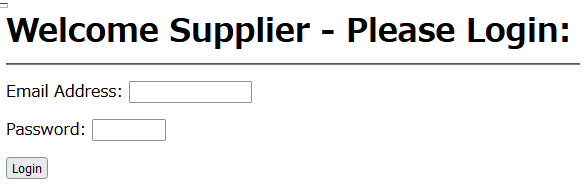
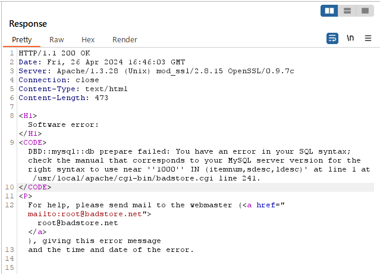
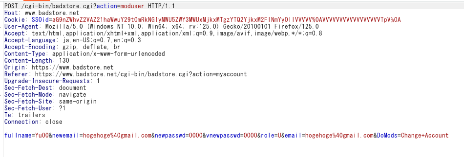
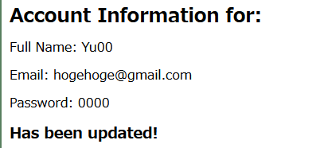

# Webアプリケーション診断報告書


- [Webアプリケーション診断報告書](#webアプリケーション診断報告書)
  - [診断内容](#診断内容)
    - [診断環境](#診断環境)
    - [対象サイト](#対象サイト)
  - [診断結果概要](#診断結果概要)
  - [非常に危険な状態](#非常に危険な状態)
  - [診断結果詳細](#診断結果詳細)
    - [SQLインジェクション(CWE-89)](#sqlインジェクションcwe-89)
    - [コマンドインジェクション(CWE-78)](#コマンドインジェクションcwe-78)
    - [パストラバーサル(CWE-22)](#パストラバーサルcwe-22)
    - [クリックジャッキング](#クリックジャッキング)
    - [認証](#認証)
      - [ログアウト機能の不備や未実装](#ログアウト機能の不備や未実装)
      - [過度な認証試行に対する対策不備や未実装(CWE-307)](#過度な認証試行に対する対策不備や未実装cwe-307)
      - [脆弱なパスワードポリシー(CWE-521)](#脆弱なパスワードポリシーcwe-521)
      - [パスワードリセットの不備(CWE-640)](#パスワードリセットの不備cwe-640)
    - [認可制御の不備(CWE-264)](#認可制御の不備cwe-264)
    - [クロスサイトリクエストフォージェリ(CWE-352)](#クロスサイトリクエストフォージェリcwe-352)
    - [セッション管理の不備](#セッション管理の不備)
      - [CookieのHttpOnly属性未設定(CWE-1004)](#cookieのhttponly属性未設定cwe-1004)
      - [推測可能なセッションID](#推測可能なセッションid)
    - [情報漏洩](#情報漏洩)
      - [画面表示上のマスク不備](#画面表示上のマスク不備)
      - [パスワードフィールドのマスク不備(CWE-549)](#パスワードフィールドのマスク不備cwe-549)
      - [HTTPS利用時のCookieのSecure属性未設定(CWE-614)](#https利用時のcookieのsecure属性未設定cwe-614)
      - [HTTPSの不備](#httpsの不備)
      - [不要な情報の存在(CWE-209)](#不要な情報の存在cwe-209)
      - [公開不要な機能、ファイル、ディレクトリの存在](#公開不要な機能ファイルディレクトリの存在)
  - [付録](#付録)
    - [参考文献](#参考文献)


## 診断内容
### 診断環境
OS:  Linux2.4.xカーネル
ブラウザ:  FireFox
診断ツール:  BurpSuite

### 対象サイト
http://www.badstore.net/


## 診断結果概要

## 非常に危険な状態

今回の診断の結果、SQLインジェクションやOSコマンドインジェクションによって、攻撃者がWebサーバーに対して直接攻撃することのできる非常に危険度の高い脆弱性が複数個発見された。
これらの脆弱性を悪用された場合、重要なファイルや、データベースに保存されている個人情報の漏えい、改ざんなどの被害が発生する可能性がある。
また、パスワードポリシーが設定されていない、容易に一般利用者の権限を書き換えることができるといった、認証、認可に関する問題も複数個発見された。

## 診断結果詳細

### SQLインジェクション(CWE-89)
1. リスク評価　高
2. 発見箇所
   
| No. | URL | パラメータ名 |
| ---- | ---- | ---- |
| 1 | http://www.badstore.net/cgi-bin/badstore.cgi | searchquery |
| 2 | https://www.badstore.net/cgi-bin/badstore.cgi?action=loginregister | email
| 3 | https://www.badstore.net/cgi-bin/badstore.cgi?action=supplierportal | email

- No.1: 商品の検索 


- No.2: ログイン画面 

 

- No.3 業者用のログイン画面




1. 脆弱性発生状況

No.1の場合について説明する。
パラメータsearchqueryに対して、「searchquery=1000'」と入力した結果、DB関係のSQL Syntax errorが表示されたため、SQLインジェクションがあると判断した。


- HTTPリクエストメッセージ


- HTTPレスポンスメッセージ



- 表示されるエラーメッセージ


4. 想定される脅威
データベースに保存されている情報の漏洩、改ざん、消去や認証回避による不正ログインの恐れがある。

5. 対応策
SQLの組み立てにプレースホルダーを用いて、バインド処理により値を割り当てる処理を推奨する。

### コマンドインジェクション(CWE-78)

1. リスク評価 高

2. 発見箇所 


| URL | パラメータ |
| -- | -- | 
| https://www.badstore.net/cgi-bin/badstore.cgi?action=supplierportal | viewfilename |

業者向けページのbadsite内価格ファイルの閲覧画面


3. 脆弱性発生状況

パラメーター「viewfilename」に```../../../../../../../bin/sleep 20|```と入力して「Go」ボタンで実行した際にレスポンスが20秒遅れて返ってくる。


4. 想定される脅威
サーバ内ファイルの閲覧、改ざん、削除や不正なシステム操作をされる恐れがある。


5. 対応策
設計段階でOSコマンド呼び出しを使わない実装方法を選択する、シェル呼び出し機能のある関数の利用を避けるといった対策がある。
シェルを起動できる言語機能を利用する場合には、保険的な対策として、引数を構成する全ての変数に対してチェックを行い、あらかじめ許可した処理のみを実行するようにする。


###　クロスサイト・スクリプティング(CWE-79)

1. リスク評価 中

2. 発見箇所
| No. | URL | パラメータ名 |
| ---- | ---- | ---- |
| 1 | https://www.badstore.net/cgi-bin/badstore.cgi | searchquery |
| 2 | https://www.badstore.net/cgi-bin/badstore.cgi?action=myaccount | fullname
| 3 | https://www.badstore.net/cgi-bin/badstore.cgi?action=guestbook | name

No.1 商品の検索


No.2 アカウント情報の更新画面


No.3 フォーム送信画面


3. 脆弱性発生状況

No.1の場合について説明する。
パラメータ「search_query」に```1000<script>alert(1)</script>```と入力した際にエスケープされずに入力したスクリプトが作動した。

作動したスクリプト

- HTTPリスエストメッセージ


- HTTPレスポンスメッセージ(一部)


4. 想定される脅威
本サイト上に偽のページが表示される、ブラウザが保存しているCookieを取得される等の可能性がある。

5. 対応策
ウェブページに出力するするすべての要素に対して、エスケープ処理を施す。
URLを出力する際にはhttp, httpsで始まるURLのみを許可する、```<script>...</script>```要素の内容を動的に生成しない等の対策をとる必要がある。


参考情報:
- エスケープ処理の実装例
```
<?php
// エスケープ処理関数
function escape_html($input) {
    return htmlspecialchars($input, ENT_QUOTES, 'UTF-8');
}

// エスケープ処理を施した文字列
$unsafe_html = "<script>alert('Hello, world!');</script>";
$safe_html = escape_html($unsafe_html);

// 安全に表示される
echo "<div>" . $safe_html . "</div>";
?>
```


### パストラバーサル(CWE-22)

1. リスク評価　高

2. 発見箇所

https://www.badstore.net/cgi-bin/badstore.cgi?action=supplierportal


3. 脆弱性発生状況

パラメータ「viewfilename」に```../../../../../../../../../etc/hosts```と入力すると、サーバ内の/etc/hostsファイルが表示されてしまう

4. 想定される脅威

hostsファイルの情報が外部に漏洩したり、改ざんや削除をされてしまう可能性がある。

5. 対応策

外部からのパラメータでウェブサーバ内のファイル名を直接指定する実装を避ける。
ファイルを開く際は、固定のディレクトリを指定し、かつファイル名にディレクトリ名が含まれないようにする。

### クリックジャッキング

1. リスク評価　中

2. 発見箇所　
  
http://www.badstore.net/cgi-bin/badstore.cgi?action=submitpayment


3. 脆弱性発生状況

決済の確定処理の直前画面において、レスポンスヘッダにX-Frame-Optionsヘッダフィールドが存在しない。


4. 想定される脅威

クリックジャッキング攻撃により、クレジットカードの番号を盗み取られる危険性がある。

5. 対応策

レスポンスヘッダにX-Frame-Optionsヘッダを出力するよう設定を行う。
X-Frame-Optionsヘッダフィールドは、コンテンツがiframeタグなどで他のサイトに埋め込まれないことを保証しており、
クリックジャッキング攻撃を防いでいる。

参考情報
PHPの場合のX-Frame-OptionsでSAMEIRIGIN(同一オリジンの場合のみiframeで表示)を設定する記述
```header('X-Frame-Options: SAMEORIGIN');```


### 認証

#### ログアウト機能の不備や未実装

1. リスク評価　中

2. 発見箇所

すべてのページ

3. 脆弱性発生状況

ログアウト機能が存在せず、手動で消去しない限りcookieが残る。

4. 想定される脅威

共有PCを使っている場合や離席中のパソコンを勝手に使用される場合に、ログインしたままのアプリケーションがあれば、勝手に使われてなりすましをされてしまう恐れがある。

5. 対応策

セッションタイムアウト時間を短くする。ログアウト機能の実装をする。

#### 過度な認証試行に対する対策不備や未実装(CWE-307)

1. リスク評価　中

2. 発見箇所

https://www.badstore.net/cgi-bin/badstore.cgi?action=loginregister


3. 脆弱性発生状況

同じユーザー名でパスワードを連続で10回間違った場合でも、アカウントがロックされない。

<!-- (4, 5 徳丸本参考) -->
4. 想定される脅威

ブルートフォース攻撃や辞書攻撃によって、繰り返し試行を行うことで不正なログインが行われてしまう。

5. 対応策

10回を目安に、パスワードを連続して間違えた場合にはアカウントをロックする。
その後は次のようなルールでアカウントの再有効化を行う

- 30分が経過した際に、自動的に再有効化する
- 何らかの方法で本人確認が行われた後に再有効化する

#### 脆弱なパスワードポリシー(CWE-521)

1. リスク評価　中

2. 発生個所

https://www.badstore.net/cgi-bin/badstore.cgi?action=loginregister
アカウントの登録画面


3. 脆弱性発生状況

パスワードを登録する際に数字のみ(例:0000)のような脆弱なパスワードが登録できてしまう。

4. 想定される脅威

パスワードが推測しやすいために、不正にログインされてしまう恐れがある。

5. 対応策

パスワードを設定する際に、8桁以上で数値と英小大文字を含むといった、パスワードポリシーを定める。

#### パスワードリセットの不備(CWE-640)

1. リスク評価　中

2. 発生個所　

アカウントの再設定画面
https://www.badstore.net/cgi-bin/badstore.cgi?action=myaccount


3. 脆弱性発生状況

パスワードリセットの際に、ユーザー本人のみが受け取れる連絡先に再設定方法が通知されるのではなく、画面上にWelcomeという再設定されたパスワードが表示され、そのままこのパスワードを利用することができる。
なお、パスワードの変更の際には、毎回、新しいパスワードとして「Welcome」という文字列が表示される。

4. 想定される脅威

新しく発行されたパスワード「Welcome」をそのままユーザーが使用し続けた場合、攻撃者は容易にパスワードを推測できてしまう。

5. 対応策

パスワードの変更のみができる仮パスワードをメールで利用者に送信する運用にする。

### 認可制御の不備(CWE-264)

1. リスク評価　高

2. 発見箇所

| No | URL | パラメータ |
| -- | -- | -- |
| 1 | https://www.badstore.net/cgi-bin/badstore.cgi?action=loginregister | role |
| 2 | https://www.badstore.net/cgi-bin/badstore.cgi?action=supplierportal | action | 
| 3 | https://www.badstore.net/cgi-bin/badstore.cgi?action=admin | action |


*アカウントの登録画面(No.1)*


*Supplier, Admin権限が必要な画面(No.2)*


*Admin権限が必要な画面(No.3)*

3. 脆弱性発生状況

NO.1の場合
新しいユーザーを作成する際に、権限を示すパラメーター「role」をUからA, Sに書き換えることで、一般ユーザーに対して、サプライヤー権限や管理者権限を付与することができる。その結果、一般ユーザーではアクセスすることのできない情報や機能が閲覧、操作できてしまう。

 

*roleをUからAに書き換え*


No.2, No.3の場合
  サプライヤー権限,admin権限が必要なページに対して、そのページのURLを指定することで、認証していない状態でアクセスできてしまう


4. 想定される脅威

一般ユーザーが本来閲覧することのできないページを閲覧、編集することで、重要なデータの漏洩、改ざんの恐れがある。

5. 対応策

権限の情報をセッション変数に保持することで書き換えを防ぐとともに、処理や表示の直前に権限の確認をするようにする。

### クロスサイトリクエストフォージェリ(CWE-352)

1. リスク評価　中

2. 発見箇所
https://www.badstore.net/cgi-bin/badstore.cgi?action=myaccount


3. 脆弱性発生状況
ログイン中にアカウント情報を更新する際に
リクエストヘッダに以下の情報が含まれておらず、

```
A: 利用者のパスワード
B: CSRF対策トークン
C: セッションID
D: CAPTCHA
```

かつ、Refererヘッダを変更しても更新処理ができてしまう。



*元のHTTPリクエストヘッダ*


 
*Refererヘッダを削除*

\\
*更新できてしまう*

4. 想定される脅威

ログイン後の利用者のみが利用可能なサービスや編集可能な情報が悪用される恐れがある。

5. 対応策

Refererヘッダがない場合や適切なURLが指定されていない場合はエラーを返すという方式にすることでCSRF攻撃を対策することができるが、
より確実な対策として、登録画面や決済画面ではトークンを埋め込む、パスワードを再入力させるという対策がある。


### セッション管理の不備


#### CookieのHttpOnly属性未設定(CWE-1004)

1. リスク評価　中

2. 発見箇所

https://www.badstore.net/cgi-bin/badstore.cgi?action=loginregister


3. 脆弱性発生状況

ログイン時のレスポンスヘッダにあるSet-CookieヘッダーフィールドにHttpOnly属性が付与されていない


4. 想定される脅威

Javascriptを使用してクッキーの値にアクセスされることで、セッションハイジャック攻撃等のリスクがある。

5. 対応策

HttpOnly属性を使用して、Javascriptからのアクセスを防ぐ。

例えば、PHPではphp.iniに以下を設定する

```session.cookie_httponly = on```


#### 推測可能なセッションID

1. リスク評価　中

2. 発見箇所

https://www.badstore.net/cgi-bin/badstore.cgi?action=loginregister


3. 脆弱性発生状況

ログイン時に発行されるセッションIDが、各ユーザーに対して固定されている。
また、セッションIDをエンコードした結果、次の法則をもとにセッションIDが生成されていることが分かった。

```
(ユーザーのセッションID) = [Email Adress]:[Password]のMD5:[Fullname] : role
```

上から順に、元のセッションID, セッションIDをURLでデコードした結果、さらにBASE64でデコードした結果。


さらに、メールアドレスとユーザー名の間の32文字の英小文字を[MD5 Decrypt](https://10015.io/tools/md5-encrypt-decrypt)でデコードした結果
パスワード「1028」が表示される


4. 想定される脅威

セッションIDが推測できることで、セッションハイジャックが可能になる。

5. 対応策

セッションIDを生成する際には、自作のセッション管理機構を自作するのではなく、アプリケーション開発ツールが備えているセッション管理機構を使用する。

### 情報漏洩

#### 画面表示上のマスク不備
1. リスク評価 弱

2. 発見箇所

https://www.badstore.net/cgi-bin/badstore.cgi?action=submitpayment
https://www.badstore.net/cgi-bin/badstore.cgi?action=viewprevious

No.1 商品の決済画面

No.2 購入履歴の画面

3.脆弱性発生状況
クレジットカードのキャッシュ番号がマスクされていない


#### パスワードフィールドのマスク不備(CWE-549)

1. リスク評価　弱

2. 発見箇所

https://www.badstore.net/cgi-bin/badstore.cgi?action=loginregister
ログイン画面

3.脆弱性発生状況
ログイン画面でのパスワードの入力がマスクされていない

<!-- (4,5 徳丸本p.487参照) -->
4. 想定される脅威

ショルダーハックにより、入力中にパスワードを盗み見されるリスクがある。

5. 対応策

type属性がpasswordのinput属性を使い、入力されたパスワードが画面上に表示されないようにする。

#### HTTPS利用時のCookieのSecure属性未設定(CWE-614)

1. リスク評価　

2. 発見箇所

https://www.badstore.net/cgi-bin/badstore.cgi?action=loginregister
ログイン、登録画面


3. 脆弱性発生状況

Httpsの利用時にCookieのSecure属性(SSL/TLSを併用したHTTPS通信でしかCookieのやり取りをしないようにする設定)が設定されていない

- 登録、ログイン時にサーバによって発行されるCookie


4. 想定される脅威

アプリケーションがHTTPSを使用していても、Secure属性がついていないCookieは平文で送られてしまう場合があり、盗聴される可能性がある。

5. 対応策

CookieにSecure属性を設定する。
例えば、PHPの場合はphp.iniに次のように設定することで、CookieにSecure属性をつけることができる

```session.cookie_secure = on```

#### HTTPSの不備

1. リスク評価　中

2. 発生個所

https://www.badstore.net/cgi-bin/badstore.cgi?action=loginregister
https://www.badstore.net/cgi-bin/badstore.cgi?action=submitpayment


3. 脆弱性発生状況

決済画面やログイン画面において、URLをhttpsからhttpに書き換えることで、HTTPSでなくHTTPでの通信ができてしまう。


4. 想定される脅威

攻撃者によってURLが改ざんされることで、HTTPSではなくHTTPで通信をすることで、クレジットカードの番号やパスワードが攻撃者に奪われてしまう。

5. 対応策

301転送により、HTTPのページにアクセスがあった場合はHTTPSのページにリダイレクトするようにする

参考情報

Apacheサーバの.htaccessファイルに以下の記述を追加することで301転送の設定ができる。
https://www.idcf.jp/rentalserver/aossl/operation/unify-access/

```
Options +FollowSymLinks
RewriteEngine on
RewriteCond %{HTTPS} off
RewriteRule ^(.*)$ https://(ドメイン名)/$1 [R=301,L]
```

#### 不要な情報の存在(CWE-209)

1. リスク評価 弱

2. 発見箇所

http://www.badstore.net/cgi-bin/badstore.cgi


http://www.badstore.net/cgi-bin/badstore.cgi?action=cartadd


3. 脆弱性発生状況

searchqueyパラメータに、データベースのItemNum欄に存在しない番号(例えば-1)を入力すると次のようなエラーメッセージが画面上に出力される


- No.2の場合
以下の画像のように、一つもカートに入っていない状態で注文ボタン(Place Order)を押すと、
ipアドレスが公開されたページへ飛んでしまう


(4, 5参考 https://softwarenote.info/p3207/)

4. 想定される脅威

エラーメッセージから、検索に使用しているSQL文が判明してしまう。それによって、SQLインジェクションなどのセキュリティのリスクがある。

5. 対応策

利用者に見せるエラーメッセージと開発者が見るデバッグ情報を明確に区別する

例えば、PHPではphp.iniで次のような設定をする
```
display_errors = Off # エラーの画面出力
log_errors = On # エラーのログ出力
```

#### 公開不要な機能、ファイル、ディレクトリの存在

1. リスク評価　弱

2. 発生個所 http://www.badstore.net/ws/

3. 脆弱性発生状況

ホーム画面のこちらのリンクから


http://www.badstore.net/ws/ に飛ぶと、
PerlやJavaのコードを見ることができてしまう。
<!-- 一部のファイルは
```
print "\nNotice:  Usage of this client is deprecated and will be removed from the server in the next year.  Our security team wants everyone to connect to the service through the WSDL and not directly anymore.\n\n";
```
とあるように、来年には削除予定のファイルが閲覧できてしまう。 -->

4. 想定される脅威

悪意のある第三者によって、ファイルが書き換えられてしまうといったリスクがある。

5. 対応策

公開するべきファイルとそうでないファイルを精査して、公開するべきでないファイルは非公開にする。


## 付録

### 参考文献
情報処理推進機構　安全なウェブサイトの作り方
https://www.ipa.go.jp/security/vuln/websecurity/about.html

情報処理推進機構　ウェブ健康診断仕様
https://www.ipa.go.jp/security/vuln/websecurity/ug65p900000196e2-att/000017319.pdf

SecuAlive CWE 一覧
https://secualive.jp/feed/cwe/list/

徳丸 浩　安全なWebアプリケーションの作り方 第2版


